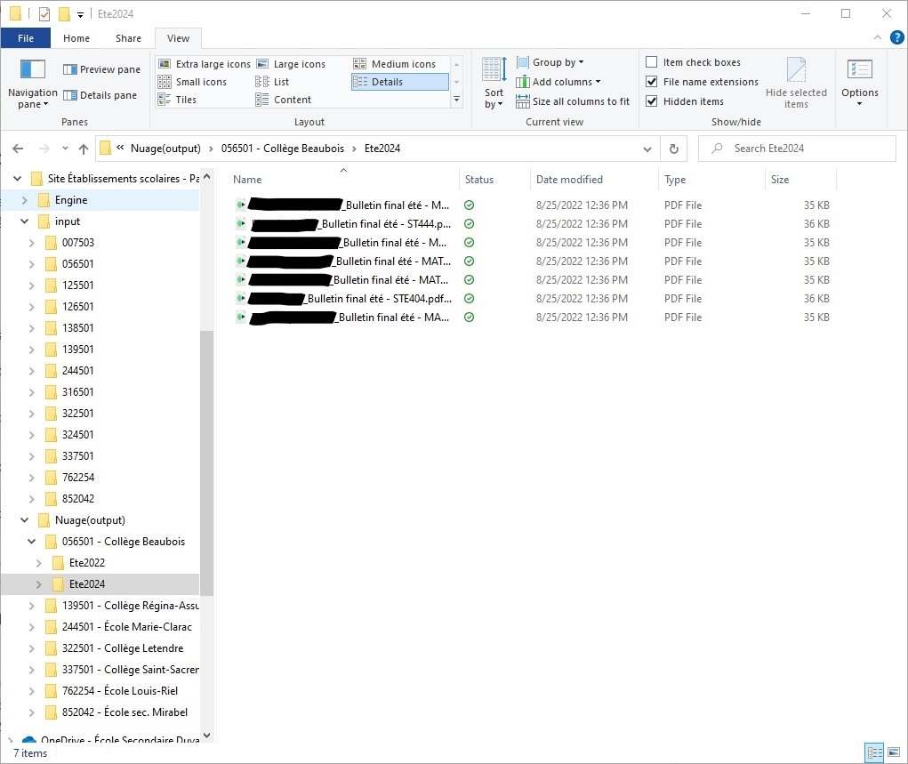

# Programme d'export des bulletins

## Informations

### Version: 1.0

### Auteur: Samuel Richard

### Dernière mise à jour: 2023-05-04

## Description

Ce programme permet d'exporter des fichiers à l'intérieur du site SharePoint _Établissement scolaires - Partage de fichier_ hébergé par l'École secondaire Duval en plus de géréer la création et la suppression des dossiers de session pour chaque école.

## Structure des fichiers

Les répertoires source et destination sont prédéfinis et ne peuvent être modifiés.

Chemin du répertoire source:  

```
École Secondaire Duval\Site Établissements scolaires - Partage de fichier\input
```

Chemin du répertoire destination:  

```
École Secondaire Duval\Site Établissements scolaires - Partage de fichier\Nuage(output)
```

Le répertoire source contient les dossiers exportés par _COBA - Pédagogie_ et identifiés par code d'organisme. Chaque dossier ne devrait contenir que les fichiers PDF des bulletins.

Le répertoire destination contient les dossiers de toutes les écoles identifiés par code d'organisme et nom selon la syntaxe suivante : `code d'organisme - nom de l'école`. Chaque dossier d'école contient des sous-dossiers de session dont la création et la suppression sont gérées par le programme. Chaque sous-dossier de session contient les bulletins de tous les élèves de l'école pour la session correspondante. Par exemple, le dossier `Nuage(output)\123456 - École secondaire Duval\Ete2023` contient les bulletins de tous les élèves de l'École secondaire Duval pour la session d'été 2023.



## Utilisation

### Options 1: Créer les dossiers de session

Cette option permet de créer les dossiers de session dans tous les dossiers école situés dans le répertoire de destination. L'utilisateur est invité a saisir le nom du dossier de session à créer. Le programme vérifie si le dossier existe déjà et affiche un message d'erreur si c'est le cas. Le programme affiche un message de confirmation lorsque l'opération est terminée.

### Options 2: Supprimer les dossiers de session

Cette option permet de supprimer les dossiers de session dans tous les dossiers école situés dans le répertoire de destination. L'utilisateur est invité a saisir le nom du dossier de session à supprimer. Le programme vérifie si le dossier existe déjà et le supprime si c'est le cas. Le programme affiche un message de confirmation lorsque l'opération est terminée.

### Options 3: Exporter les bulletins

Cette option permet d'exporter les bulletins dans les dossiers de session correspondants. Le programme vérifie si le dossier de session existe déjà et affiche un message d'erreur si ce n'est pas le cas. Le programme affiche un message de confirmation lorsque l'opération est terminée.
